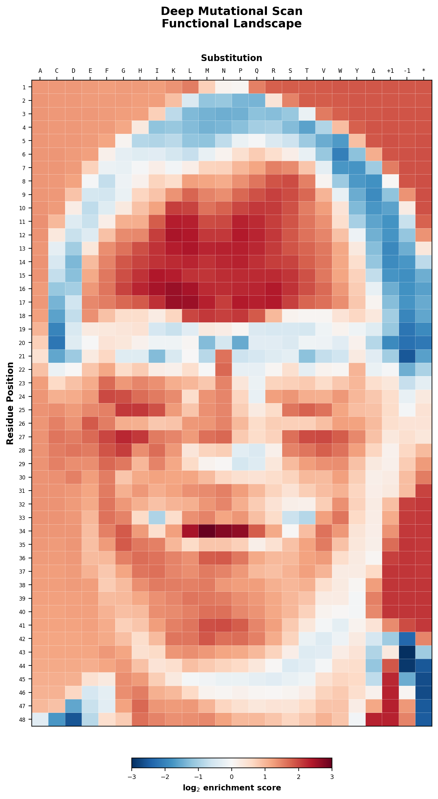

# DMS Heatmap Raster

Turn any photograph into a publication-style **deep mutational scanning (DMS) heatmap**.

The script converts an image to grayscale, downsamples it into a coarse grid, maps each cell's mean luminance to a log₂ enrichment score, and renders the result with the same aesthetic you'd find in a DMS figure — diverging colormap, amino acid substitution labels on the x-axis, residue positions on the y-axis, and a colorbar.




## Installation

```bash
pip install numpy matplotlib Pillow
```

Python 3.8+ is required.

## Usage

Process your own image:

```bash
python dms_heatmap_portrait.py path/to/your_photo.jpg
```

Two files are written to the same directory as the input image (or the script directory if no image is provided):

| Output file            | Description                                  |
|------------------------|----------------------------------------------|
| `dms_heatmap.png`      | The final DMS-style heatmap (200 dpi)        |
| `portrait_grayscale.png` | Grayscale version of the input for reference |

## Configuration

These constants at the top of the script control the output:

```python
GRID_AA = 24          # substitution types (x-axis columns)
GRID_POSITIONS = 48   # residue positions (y-axis rows)
COLORMAP = "RdBu_r"   # any matplotlib diverging colormap works
```

Changing `GRID_POSITIONS` and `GRID_AA` together adjusts resolution. Keep the ratio roughly 2:1 (positions:AAs) to maintain square cells. Some alternative colormaps worth trying: `coolwarm`, `PiYG`, `BrBG`, `seismic`.


## License

MIT
